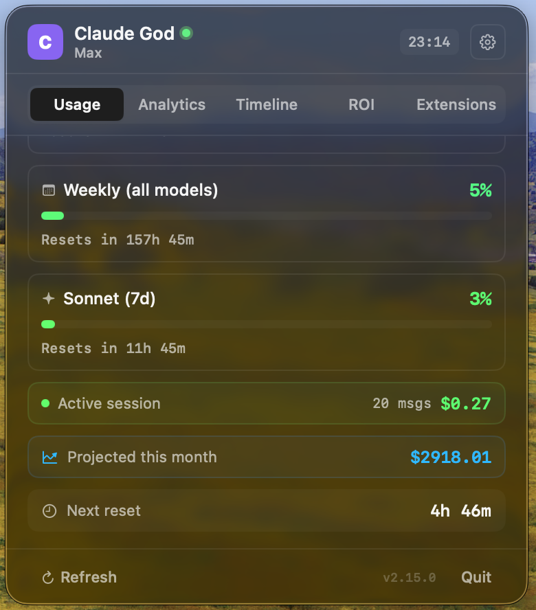
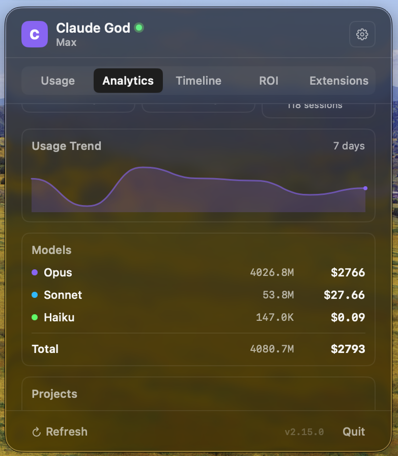
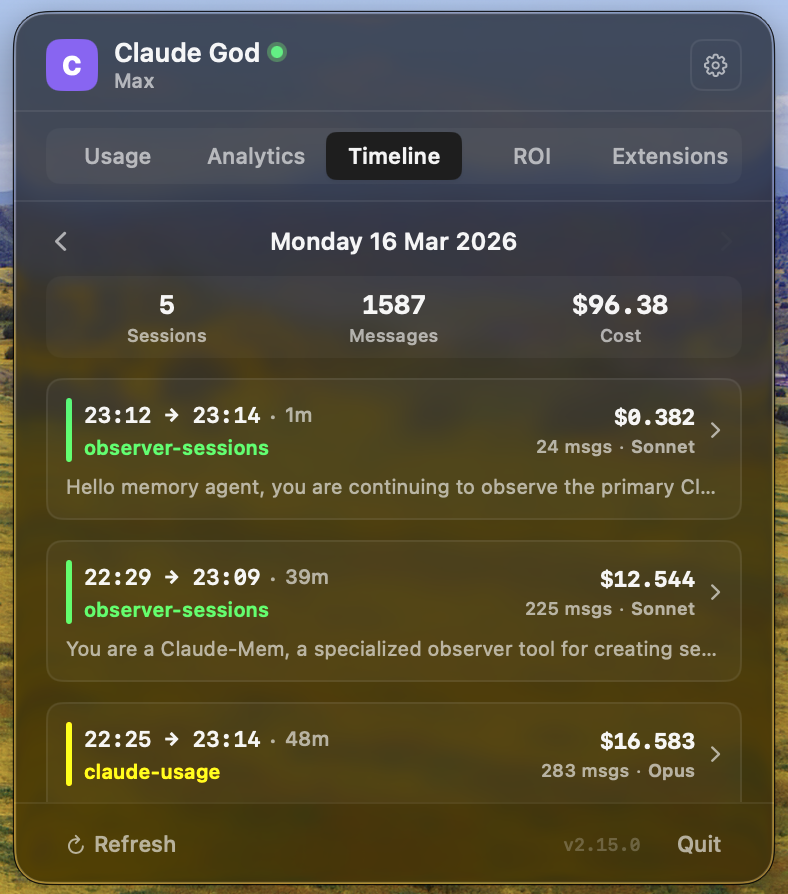
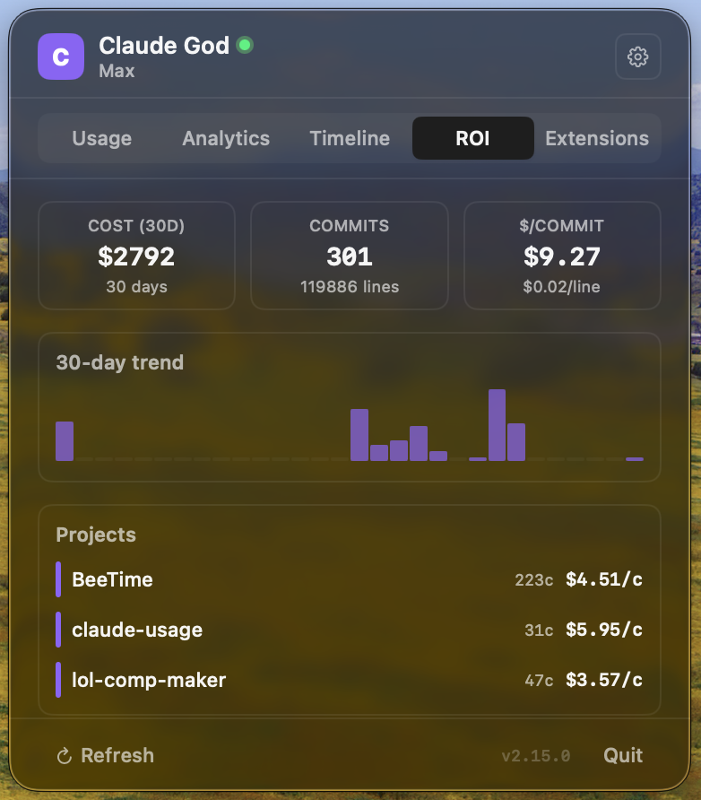

<p align="center">
  
  
  
  
  <a href="https://github.com/Lcharvol/Claude-God/actions/workflows/ci.yml"></a>
</p>

<h1 align="center">
  Claude God
</h1>

<p align="center">
  <strong>Monitor your Claude AI usage from the macOS menu bar.</strong><br>
  Real-time quotas, cost analytics, burn rate prediction, project breakdown.<br>
  Free, open source, zero dependencies.
</p>

<p align="center">
  
  &nbsp;&nbsp;
  
</p>
<p align="center">
  
  &nbsp;&nbsp;
  
</p>
<p align="center">
  
  &nbsp;&nbsp;
  
</p>

<p align="center">
  <a href="https://github.com/Lcharvol/Claude-God/releases/latest/download/ClaudeGod.dmg"><strong>Download .dmg</strong></a> &nbsp;&middot;&nbsp;
  <a href="https://claudegod.app">Website</a> &nbsp;&middot;&nbsp;
  <a href="https://github.com/Lcharvol/Claude-God/releases">Changelog</a>
</p>

---

## Features

| | Feature | Description |
|---|---|---|
| **Quotas** | Progress bars | Animated bars for session (5h), weekly, Sonnet & Opus quotas |
| | Dynamic icon | Menu bar icon turns green/orange/red based on worst quota |
| | Live countdown | Real-time timer showing when quotas reset |
| | Burn rate | Predicts when you'll hit the limit based on current velocity |
| | Model advisor | Smart tips when quota imbalance is detected |
| **Analytics** | Cost tracking | Daily, weekly, monthly cost breakdown from JSONL session files |
| | Project breakdown | Per-project cost and session count |
| | Session history | Recent conversations with topic, duration, cost, model |
| | Sparkline chart | Interactive usage trend (7/14/30 days) with hover tooltips |
| | Model breakdown | Per-model cost and token usage with totals |
| | Daily budget | Set a $/day target with progress tracking |
| | Export CSV | Save daily cost & token data as CSV |
| | Copy stats | One-click copy of formatted stats to clipboard |
| **Live** | Active session | Detects when Claude Code is running (green dot) |
| | Auto-credentials | File watcher auto-detects `claude login` |
| | Reset notification | Get notified when quotas reset |
| **Settings** | Auto-refresh | Configurable interval (1, 2, 5, 10 min) |
| | Menu bar modes | Icon only, Session %, Timer, All quotas |
| | Compact mode | Minimal UI showing just percentages |
| | Notifications | Alert when usage exceeds configurable threshold |
| | Launch at login | Start automatically with macOS |
| **Extensions** | Plugin marketplace | Browse, search, and install Claude Code plugins directly from the app |
| | Category filter | Filter plugins by category (Development, Productivity, Database, etc.) |
| | Install counts | See plugin popularity with download stats |
| | Manage plugins | Toggle enabled/disabled, uninstall, check for updates |
| | Plugin UI | Installed plugins with custom UI (e.g. claude-mem) open inline detail views |
| **Design** | shadcn/ui style | Flat, minimal, bordered cards with hover effects |
| | Dark & Light | Adapts to system appearance automatically |
| | Accessibility | VoiceOver labels on all interactive elements |

> **No API key needed.** Uses your existing `claude login` credentials. Works with Pro & Max plans. Completely free.

---

## Quick Start

### Homebrew (recommended)

```bash
brew tap lcharvol/tap
brew install --cask claude-god
```

### Manual

```bash
# 1. Download & install
open https://github.com/Lcharvol/Claude-God/releases/latest/download/ClaudeGod.dmg

# 2. Allow unsigned app (required once)
xattr -cr /Applications/Claude\ God.app
```

### Then

```bash
# Make sure you're logged in
claude login

# Launch — a "C" icon appears in the menu bar, press ⌥⌘C to toggle
open /Applications/Claude\ God.app
```

---

## How It Works

**Quotas** — The app reads your OAuth credentials from `claude login` (Keychain or `~/.claude/.credentials.json`) and calls:

```
GET https://api.anthropic.com/api/oauth/usage
Authorization: Bearer <oauth_token>
anthropic-beta: oauth-2025-04-20
```

Returns utilization for each quota window (`five_hour`, `seven_day`, `seven_day_sonnet`, `seven_day_opus`). Tokens are refreshed automatically.

**Cost Analytics** — Parses all `~/.claude/projects/**/*.jsonl` session files to calculate costs per model using Anthropic's published pricing.

---

## Build from Source

```bash
git clone https://github.com/Lcharvol/Claude-God.git
cd Claude-God
brew install xcodegen    # one time
make build               # or: make open (Xcode)
```

See [`Makefile`](Makefile) for all commands: `build`, `run`, `dmg`, `clean`.

## Project Structure

```
Sources/
├── ClaudeUsageApp.swift     # Entry point, MenuBarExtra
├── UsageManager.swift       # OAuth, auto-refresh, notifications, budget, active session
├── AuthManager.swift        # Credential loading, token refresh, file watcher
├── UpdateChecker.swift      # GitHub releases auto-update
├── HotkeyManager.swift      # Global ⌥⌘C hotkey (Carbon API)
├── AppShortcuts.swift       # Shortcuts.app intents (Get Usage, Get Cost, Refresh)
├── MenuBarView.swift        # UI: cards, stats, settings, heatmap, shadcn components
├── SessionAnalyzer.swift    # JSONL parser, cost calculator, efficiency metrics
└── Assets.xcassets/         # App icon
Widget/
└── ClaudeGodWidget.swift    # WidgetKit — desktop quota gauges
```

**Zero external dependencies.** Foundation + SwiftUI + Combine + Security + UserNotifications + ServiceManagement.

## Releasing

```bash
git tag v2.8.0 && git push origin v2.8.0
# GitHub Actions builds the .dmg automatically
```

## Changelog

### v2.21.1
- **Fixed**: Drastic energy savings — App Nap re-enabled, adaptive countdown, slower active-session polling, JSONL scan deferred to popover open ([#14](https://github.com/Lcharvol/Claude-God/issues/14))
- **Fixed**: Widget extension now registers — added missing `NSExtensionPointIdentifier` ([#13](https://github.com/Lcharvol/Claude-God/issues/13))
- **Fixed**: Resizable popover actually responds to drag — visible grip handle replaces the broken NSWindow wiring

### v2.21.0
- **New**: Session+Week menu bar mode — session %, reset countdown, and weekly % at a glance ([#15](https://github.com/Lcharvol/Claude-God/issues/15))
- **New**: Resizable window with persisted height
- **New**: Extra usage balance card + Claude Design quota row
- **New**: Sign In button + opt-in auto-reconnect when OAuth token expires
- **Fixed**: Usage tab flicker on expired token, long reset times shown as days/hours

### v2.20.4
- **Fixed**: Hardened refresh pipeline — every exit path clears loading state, credential reload timeouts, backoff counter auto-resets

### v2.20.3
- **Fixed**: Respect `Retry-After` header on 429, progressive backoff, token expiry pre-flight, Keychain fallback for credentials

### v2.20.2
- **Fixed**: App no longer gets stuck on "Rate limited" screen after `claude login` ([#5](https://github.com/Lcharvol/Claude-God/issues/5))
- **Fixed**: Credential changes now trigger auto-refresh even when an error is displayed

### v2.20.1
- **Fixed**: Refresh no longer gets stuck — cancellable fetches, stale response detection, centralized state reset
- **New**: Peak / off-peak indicator with countdown to transition

### v2.19.0
- **Perf**: JSONL parsing without Data→String roundtrip, SQLite 9→4 queries, widget skip unchanged, keychain off main thread

### v2.18.0
- **New**: GitHub, swift-lsp, code-review, code-simplifier, context7, playwright plugin detail views (9 total)
- **Fixed**: Menu bar icon contrast, font sizes +1pt, wider window

### v2.17.0
- **New**: Superpowers plugin UI — browse skills, view plans with progress, design specs
- **New**: Frontend Design plugin UI — design principles, aesthetic tones, anti-patterns, cookbook link

### v2.16.0
- **New**: Extensions tab with plugin marketplace — browse, install, and manage Claude Code plugins directly from the app
- **New**: Featured plugin cards for plugins with custom UI (claude-mem opens inline Memory panel)

### v2.15.0
- **Fixed**: Memory tab now reads correct claude-mem schema (`observations` table)
- **New**: Activity timeline, project summaries, Markdown export, delete observations, open files in Finder

### v2.14.0
- **New**: Memory tab — browse claude-mem persistent memories with search, project filter, and install guide

### v2.13.1
- **Fix**: OAuth token refresh no longer persists tokens — prevents daily 401 errors

### v2.13.0
- **Perf**: Single JSON decode per JSONL line, direct Data line splitting, single-pass file traversal, binary search for ROI matching

### v2.12.0
- **Improved**: Logging, error handling, forecasting, and exports

### v2.11.0
- **New**: ROI tab — correlates git commits with Claude sessions (cost/commit, per-project, per-model, 30-day trend)

### v2.10.0
- **New**: Updated model pricing, landing page SEO, download counter
- **Fix**: Project cost truncation, mobile layout, 429 handling

### v2.9.0
- **Fix**: Token refresh race condition, notification spam, reset timer, CSV export, duplicate alert rules

### v2.8.0
- **New**: Desktop widget, usage heatmap, live session cost, per-project budgets, Shortcuts.app, multi-account, custom alerts

[Full changelog →](CHANGELOG.md)

## License

[MIT](LICENSE)
